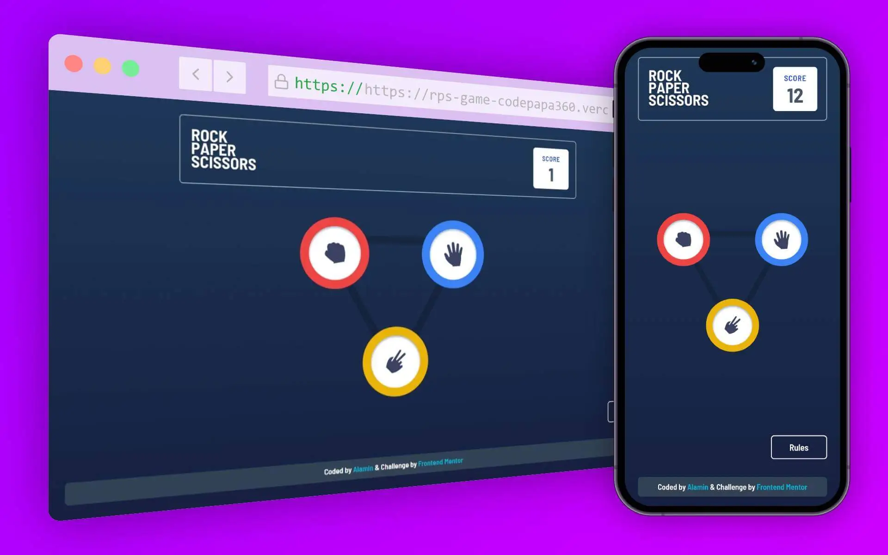

<h1 align="center">Rock, Paper, Scissors game</h1>

<h2 align="center">

[🖱️Live Website](https://rps-game-codepapa360.vercel.app)

</h2>

<!-- Badges -->
<div align="center">

[](https://www.linkedin.com/in/CodePapa360)
[](https://x.com/CodePapa360)


</div>

<!-- Brief -->
<p align="center">
This project is a solution to the Rock-Paper-Scissors challenge from Frontend Mentor. Initially built with vanilla JavaScript, the main objective was to practice TypeScript while solidifying core web development concepts. I plan to further enhance the project by transitioning it to React with TypeScript.
</p>

<!-- Screenshot -->
<a align="center" href="https://rps-game-codepapa360.vercel.app">



</a>

## Table of contents

- [Links](#links)
- [The challenge](#the-challenge)
- [My process](#my-process)
  - [Built with](#built-with)
  - [What I learned](#what-i-learned)
  - [Continued development](#continued-development)
- [Author](#author)
- [Acknowledgments](#acknowledgments)
- [License](#license)

### Links

- Live Site URL: [Click here](https://rps-game-codepapa360.vercel.app)
- Solution URL: [Click here](https://www.frontendmentor.io/solutions/rock-paper-scissors-game-with-typescript-fe6IN10Ent)

### The challenge

Users should be able to:

- View the optimal layout for the game depending on their device's screen size
- Play Rock, Paper, Scissors against the computer
- Maintain the state of the score after refreshing the browser _(optional)_

## Built with

- TypeScript
- Tailwind CSS
- HTML5
- Mobile-first workflow
- Vite

## What I Learned

Through this project, I strengthened my understanding of TypeScript in a vanilla JavaScript environment. It allowed me to explore static typing, improve code clarity, and enforce safer coding practices. Additionally, I gained hands-on experience in DOM manipulation using TypeScript, even without a framework. As I move forward with converting this project to React, I’m excited to deepen my experience with TypeScript, focusing on React components, JSX, and state management.

## Continued Development:

Next, I will refactor this project to React, utilizing TypeScript for better component structure and state management. My focus will be on improving reusability, type safety, and exploring testing strategies for React and TypeScript.

## Installation

- Clone this repo:

```sh
git clone https://github.com/CodePapa360/Rock-Paper-Scissors.git
```

- Install dependencies:

```sh
npm install
```

- Live server:

```sh
npm run dev
```

- Build command:

```sh
npm run build
```

## Author

<b>👤 Alamin</b>

- LinkedIn - [@CodePapa360](https://www.linkedin.com/in/codepapa360)
- Twitter - [@CodePapa360](https://www.twitter.com/CodePapa360)
- GitHub: [@CodePapa360](https://github.com/codepapa360)
- Frontend Mentor - [@CodePapa360](https://www.frontendmentor.io/profile/CodePapa360)

Feel free to contact me with any questions or feedback!

## Acknowledgments

The project was inspired by [this](https://www.frontendmentor.io/challenges/rock-paper-scissors-game-pTgwgvgH) challenge from Frontend Mentor. Special thanks to Frontend Mentor for providing the design and specifications for this project.

## License

This project is licensed under the [Apache License 2.0](./LICENSE.md) License - see the LICENSE file for details.

